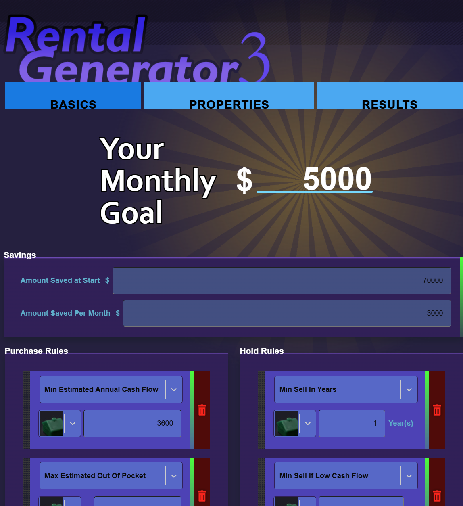

# rental-timeline-estimator

A website that runs the rental-investor-timeline app

A way to determine if and when your expenses would be covered through rental properties

Will be based on version 1 (this will also replace it when published)

1. ~~https://bitbucket.org/kellyvernon/realty-generator-core~~ https://github.com/kvernon/realty-investor-timeline (a private repo by me).
2. version 1 live: http://cubedelement.com/realty/

> Note: this version 1 above is buggy. I was racing to get the pieces together way back in the day.

## Inspiration

This was originally used as a discussion point between me and my SO. The idea is that we like our jobs, but we also want
a way to ensure that if anything happens to us, we would be able to sustain our income.

For me, I was inspired by a game originally from early 2000's where you could quickly click on houses and flip them, but
after this idea and speaking with mentors, the idea has become find an optimal way to _ramp-up_.

> ☝️Mentors are great! They do a great job at helping you discover how to get to the next point in your life. Also, a
> mentor is someone who has done the thing and is either where you've been or want to go. AKA, don't ask a someone how
> to become a CEO when that person has never been a CEO. (Hopefully that give you a good idea)

## What this does

As mentioned prior, we want to find a way to _ramp-up_. This library will work through the scenarios of houses and
provide a way to collect them. Once it completes, it'll provide feedback as to why you passed on a property.

For example, it could be that you didn't have enough cash. Another is that you may have wanted more cash flow per month.
After you see the trends, and based on the time-line hand at play, you could realize that you might need to expand on
your ideal finds.

The library loop simulates a per-month savings. In there it will take your money saved and determine if you have enough
to acquire more properties. Equally, we run through selling of properties too, because it's a common practice.

## Building

### Node version

On linux, mac, etc... do: `$ nvm install`, referencing this manager: `https://github.com/nvm-sh/nvm`

on windows: `$ nvs install`, referencing this manager: `https://github.com/jasongin/nvs`

### Getting the Repo up and running

#### Install libs

`$ npm ci`

#### Run tests

`$ npm run tests`

> ☝️This can run using [Wallaby.js](https://wallabyjs.com/) in automatic config or with the config file, [wallaby.js](./wallaby.js)

## Progress

This is to show progress

_image: User Settings_

## helpful links:

1. https://testing-library.com/
2. https://reactjs.org/
3. https://create-react-app.dev/
4. https://react-select.com/typescript
5. https://emotion.sh/docs/@emotion/styled
6. https://konstantinlebedev.com/solid-in-react/
7. https://www.everydayreact.com/articles/solid-principles-in-react
8. https://github.com/tajo/react-movable
9. note: styling seems to work: https://codesandbox.io/s/clever-wing-skxhlr... might be a problem with react-select
